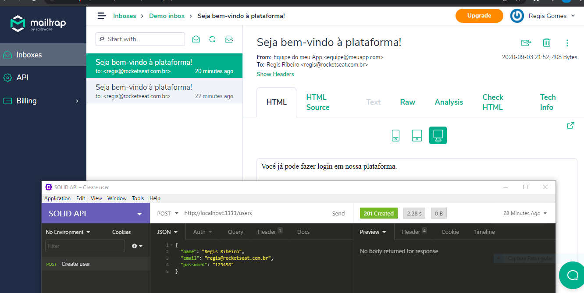

# API-REST-SOLID
 API REST com Node.js, Express e TypeScript usando arquitetura SOLID
 
 Criando usuário e enviando de email, gerando ID no código usando UUIDV4 para gerar ids únicos universais, 
 tirando a responsabilidade do banco de dados e foi usado também nodemailer para testar envio de emails em desenvolvimento. 
 Aplicação Testada com Insomnia.
 
 
